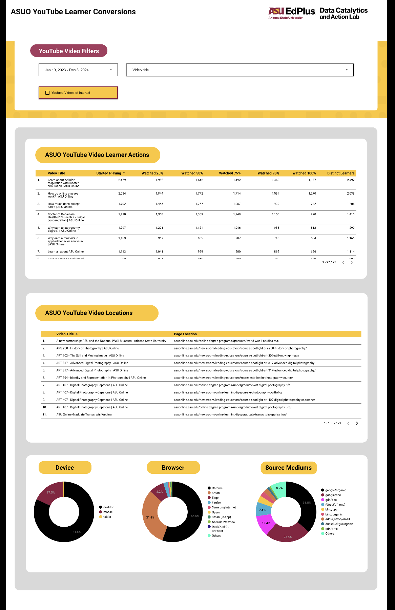
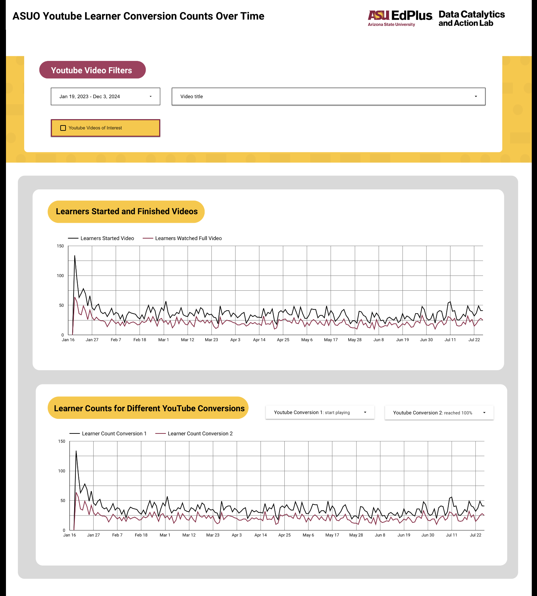
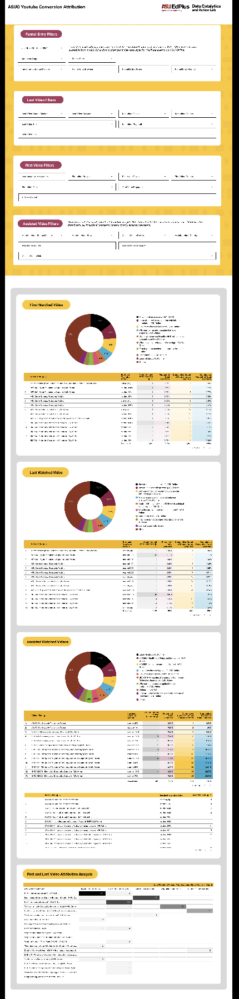

# ASUO-YouTube-Learner-Conversions-Analysis
This project showcases a Looker Dashboard and SQL queries used for analyzing ASUO YouTube conversions and user interactions. It highlights insights on video engagement, traffic sources, and device usage.

## Project Overview
The goal of this project was to analyze YouTube video performance and user behavior to derive actionable insights for optimizing content strategy. By integrating GA4 event-level data with Looker visualizations, this analysis provides a comprehensive view of user engagement across various touchpoints.

## Features
- Looker Dashboard Screenshots
- BigQuery Queries for:
  1. Video Engagement Analysis
  2. User Conversion Tracking
  3. Interaction Attribution

## Tools
- **Looker:** For visualizing YouTube conversion data.
- **BigQuery:** For querying raw event-level data from Google Analytics 4 (GA4).

## Analysis Highlights
1. Device and browser usage trends.
2. Conversion funnel metrics (started, watched percentages).
3. Attribution of first, last, and assisted videos in user journeys.

## Dashboard Screenshots

### 1. **Video Engagement Metrics**
This dashboard shows how learners interact with videos, highlighting metrics and completion rates at various stages (e.g., started, 25%, 50%, 75%, 100%).

### 2. **Conversion Trends Over Time**
Tracks how learner engagement and video conversions fluctuate over time, offering insights into seasonal and weekly trends.

### 3. **Attribution Analysis**
Analyzes the role of the first and last and assisted videos in driving user conversions and engagement.

## BigQuery SQL Queries

### 1. Video Engagement Analysis
This query extracts YouTube video interaction data and calculates metrics such as start rates and completion rates for each video.

[View Query](queries/youtube_video_engagement.sql)

### 2. User Conversion Tracking
This query identifies user interactions across different touchpoints and links them to Salesforce IDs.

[View Query](queries/user_conversion_tracking.sql)

### 3. Interaction Attribution
This query attributes user conversions to the first, last, and assisted YouTube videos in their journey.

[View Query](queries/interaction_attribution.sql)

## Key Insights
- **Video Engagement**: Most users drop off after 25% completion.
- **Device Usage**: Mobile users account for 50% of views.
- **Attribution**: The first video watched significantly impacts conversion likelihood.
